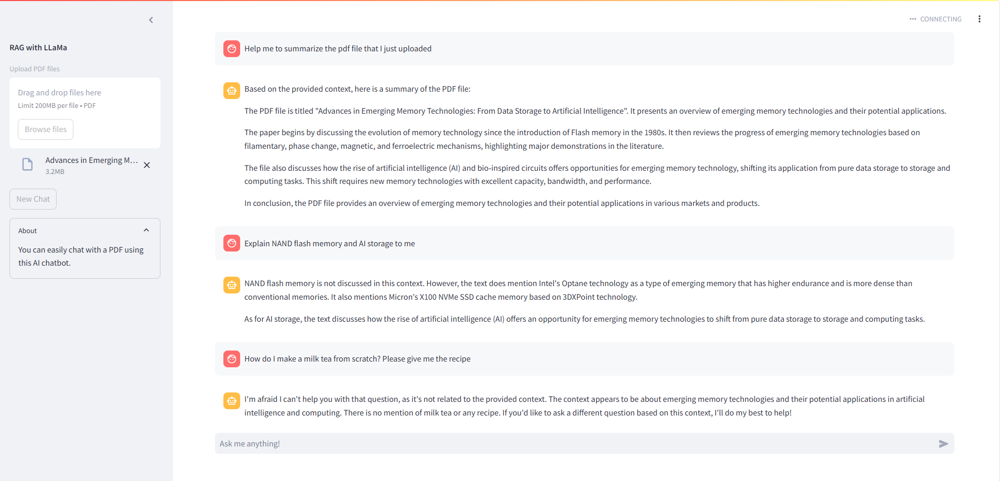

# RAG Based on LLaMa 3

## Description
This project implements a Retrieval-Augmented Generation (RAG) system using the LLaMA 3 model. The system combines retrieval-based and generation-based approaches to provide accurate and contextually relevant responses from PDF files. The GUI is deployed using Streamlit and ngrok.

## Features
  - **Retrieval-Augmented Generation**: Combines retrieval and generation for improved response accuracy.
  - **LLaMA 3 Model**: Utilizes the LLaMA 3 model for natural language understanding and generation.
  - **PDF Support**: Extracts and processes information from PDF files.
  - **Scalable**: Designed to handle large datasets and provide fast responses.
  - **Configurable**: Easily configurable to suit different use cases.
  - **Streamlit GUI**: User-friendly interface for interacting with the system.
  - **ngrok Integration**: Easily expose the Streamlit app to the web.

## Installation
To install the project, follow these steps:

1. Open Google Colab and ensure GPU is enabled:
    - Navigate to `Runtime` > `Change runtime type`.
    - Set `Hardware accelerator` to `GPU`.

2. Clone the repository in a Colab notebook:
    ```python
    !git clone https://github.com/yourusername/rag-llama.git
    %cd rag-llama
    ```

3. Install the required dependencies:
    ```python
    !pip install --upgrade --quiet langchain langchain_community pdfplumber chromadb tqdm streamlit ollama pyngrok
    ```

4. Install `ollama`:
    ```python
    !curl https://ollama.ai/install.sh | sh
    ```

5. Start the `ollama` service and pull `llama3` and `nomic-embed-text`:
    ```python
    !ollama serve > rocama.log 2>&1 &
    !ollama pull llama3 & ollama pull nomic-embed-text
    ```

## Usage
To use the RAG system, follow these steps in your Colab notebook:

1. **Set the NGROK_AUTH_KEY**:
    - Navigate to `Secrets` > `+ Add new secret`.
    - Add your own ngrok authtoken as an environment variable: `NGROK_AUTH_KEY`.

2. **Deploy the Streamlit App**:
    ```python
    !nohup streamlit run app.py --server.port 8501 &
    ```

3. **Expose the Streamlit App using ngrok**:
    ```python
    !pip install pyngrok
    from pyngrok import ngrok

    # Start ngrok tunnel to expose the Streamlit server
    ngrok_tunnel = ngrok.connect(addr='8501', proto='http', bind_tls=True)

    # Print the URL of the ngrok tunnel
    print(' * Tunnel URL:', ngrok_tunnel.public_url)
    ```

    The tunnel URL for the chatbot GUI will be available at the console.

## Demonstration
